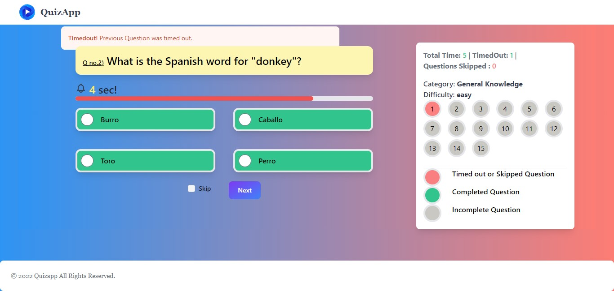

# Quiz App using Svelte + Vite + Code Igniter 3

Welcome to the QuizApp repository! The Svelte framework and Vite as the build tool were used to create this straightforward quiz application's front end and CodeIgniter 3 for the backend. Users of the QuizApp can take quizzes on a variety of subjects and receive immediate feedback on their responses.

## Question data

Questions and answers data are fetched from PostgreSql database.

## Features

    - Fetched data from PostgreSql database.
    - Keep track of your quiz scores.
    - Take quizzes on a variety of topics.
    - Marks based on time spent by user on the question.
    - User-friendly and responsive design.
    - Randomized question order for a fresh experience every time.



## Table of Contents

- [Getting Started](#getting-started)
- [Contributing](#contributing)

## Getting Started

To get a local copy of the QuizApp up and running, follow these steps:

1. Clone this repository to your local machine:

```bash
    git clone https://github.com/shardz9090/Full-Stack-Quizapp.git
```

2. Start the development server using local server (xampp or wampp)

3. Open your web browser and go to http://localhost/Full-Stack-Quizapp to view the QuizApp.

## Contributing

Contributions are welcome! If you'd like to contribute to this project, please follow these steps:

    1. Fork the repository.
    2. Create a new branch for your feature or bug fix.
    3. Make your changes and commit them.
    4. Push your changes to your fork.
    5. Submit a pull request to the main repository.

Thank you for checking out the QuizApp! If you have any questions or encounter any issues, please feel free to open an issue in this repository.
