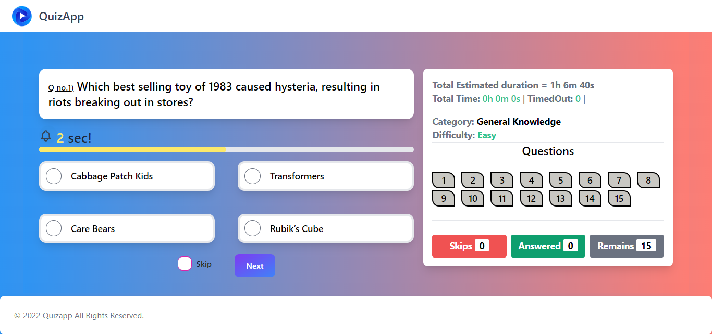

# Quiz App using Svelte + Vite

Welcome to the QuizApp repository! The Svelte framework and Vite as the build tool were used to create this straightforward quiz application. This code is used for backend integration so it will not work unless used with backend [Full stack app](https://github.com/shardz9090/Full-Stack-Quizapp).

## Question data

Questions and answers data are fetched from database.

## Features

    - Fetched data from database.
    - Take quizzes on a variety of topics.
    - Marks based on time spent by user on the question.
    - User-friendly and responsive design.
    - Randomized question order for a fresh experience every time.

## Table of Contents

- [Folder Structure](#folder-structure)
- [Contributing](#contributing)

## Folder Structure

The project structure is organized as follows: - dist/: contains files that are used for integrating in backend. - src/: Source code for the QuizApp. - lib/: Svelte components used in the application. - details/ : Svelte Components - App.css - App.svelte: The main Svelte component. - main.js: The entry point for the application. - vite.config.js: Configuration file for Vite.

## Contributing

Contributions are welcome! If you'd like to contribute to this project, please follow these steps:

    1. Fork the repository.
    2. Create a new branch for your feature or bug fix.
    3. Make your changes and commit them.
    4. Push your changes to your fork.
    5. Submit a pull request to the main repository.

Thank you for checking out the QuizApp! If you have any questions or encounter any issues, please feel free to open an issue in this repository.
